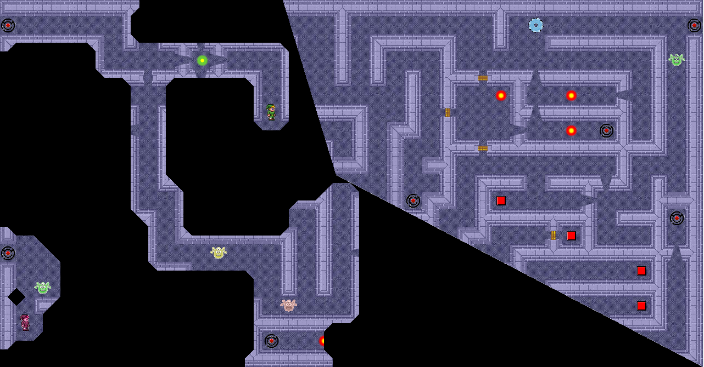
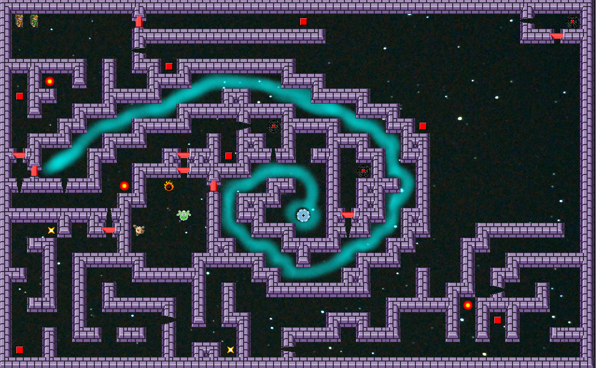
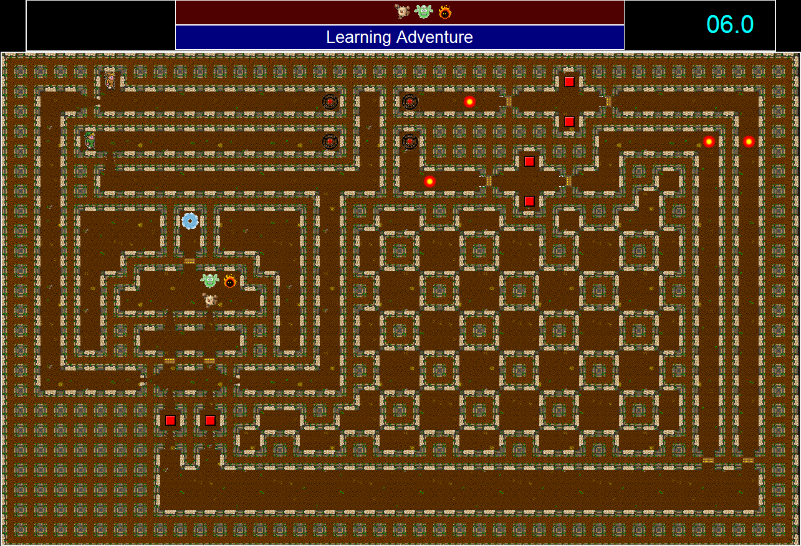

# PyLabyrinthe
A 2D Graphical Labyrinthe Game.

	

Use the PyGame Libary and run in Python 3.X

## Dependecies

### PyGame 1.9.3+

WebSite of PyGame : http://www.pygame.org/news
GitHub : https://github.com/pygame/

## Description
* To lunch the game run : game.py
* You can add a new map by creatin a JSON file under ./maps (template.json can be starting point) (see <a href="https://github.com/yoann-darche/PyLabyrinthe/wiki/Comment-cr%C3%A9er-une-nouvelle-carte">Wiki</a>)
* To add new tile, or graphics element go to ./sprite
* To udpate the map list update the game.py (GameSession.loadMapList())
* To customize the Monster move strategy, edit the MonsterEngine.py

# State
In progress

# ScreenShoot & Map
## Spirale 5 Sept. 2017

	

## Learning Adventure

	

